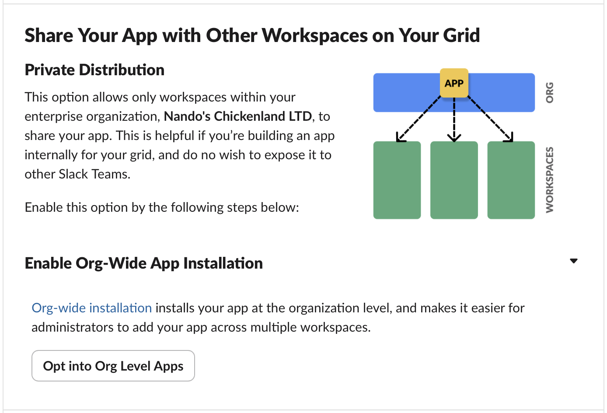

# Enterprise Grid Setup Guide

Complete step-by-step guide for setting up Slack Channel Manager with Slack Enterprise Grid, including screenshots.

## Prerequisites

- Slack Enterprise Grid organization
- Organization Admin permissions
- Node.js 18+ installed

## Automated Setup

**Recommended:** Use the guided setup wizard:

```bash
npm run setup
```

Choose "Create new app" and follow the interactive prompts.

## Manual Setup with Screenshots

### Step 1: Create Slack App

1. **Start the setup wizard:**

   ```bash
   npm run setup
   ```

   Choose "Create new app" → "Yes" to open browser

2. **Create new app:**
   
   - Click "From scratch"

3. **App details:**
   
   - App Name: `Slack Channel Manager Enterprise`
   - Select any workspace in your Enterprise Grid
   - Click "Create App"

### Step 2: Configure Bot Scopes

4. **App dashboard:**
   
   - Note the sidebar options

5. **OAuth & Permissions:**
   
   - Click "OAuth & Permissions" in sidebar

6. **Add bot scopes:**
   
   Add these to "Bot Token Scopes":
   - `channels:read`
   - `channels:history`
   - `channels:manage`
   - `groups:read`
   - `groups:history`
   - `groups:write`

### Step 3: Configure OAuth Settings

7. **Add redirect URL:**
   
   - In "Redirect URLs" section
   - Add: `https://slack.com/oauth/callback`
   - Click "Save URLs"

### Step 4: Enable Enterprise Grid Distribution

8. **Manage Distribution:**
   
   - Click "Manage Distribution" in sidebar

9. **Enable org-wide installation:**
   
   - Enable "Org-Wide App Installation"

10. **Complete distribution requirements:**
    
    - Complete any required sections
    - You can skip "Activate Public Distribution" for internal use

### Step 5: Install to Organization

11. **Return to OAuth & Permissions:**
    
    - Should now see "Install to Organization" button

12. **Install to organization:**
    
    - Click "Install to Organization" (NOT workspace)

13. **Authorize the app:**
    
    - Review permissions
    - Click "Allow"

### Step 6: Complete Setup

14. **Copy bot token:**
    
    - Copy the "Bot User OAuth Token" (starts with `xoxb-`)

15. **Paste in setup wizard:**
    
    - Return to terminal and paste token
    - Complete workspace selection

16. **First test run:**

    - Run `npm start` to test

## Verification Checklist

✅ **App created with correct name**  
✅ **Bot scopes added (not user scopes)**  
✅ **Redirect URL configured**  
✅ **Org-wide installation enabled**  
✅ **Installed to organization (not workspace)**  
✅ **Bot token obtained and configured**  
✅ **Multiple workspaces discovered**  
✅ **Test run shows channel analysis**  

## Troubleshooting

### "Invalid client_id parameter"

- Ensure redirect URL is set correctly
- Try uninstalling and reinstalling the app

### "no_bot_scopes_requested"

- Make sure scopes are added to "Bot Token Scopes" (not "User Token Scopes")

### "App not showing in other workspaces"

- Verify organization-level installation (not workspace-level)
- Check that org-wide installation is enabled

### "not_in_channel" warnings

- Normal behavior for private channels
- Tool uses conservative rules for inaccessible channels

## Screenshots

All setup screenshots are stored in `docs/screenshots/` and referenced in this guide.

To add your own screenshots:

1. Save screenshots with descriptive names
2. Place in `docs/screenshots/` folder  
3. Update this guide with references
4. Use `git add docs/screenshots/specific-file.png` to include them

## Next Steps

After successful setup:

- Run channel analysis: `npm start`
- Customize archiving rules: `npm start -- --max-members-inactive 5`
- Add more workspaces: `npm run setup` → "Add/remove workspaces"
